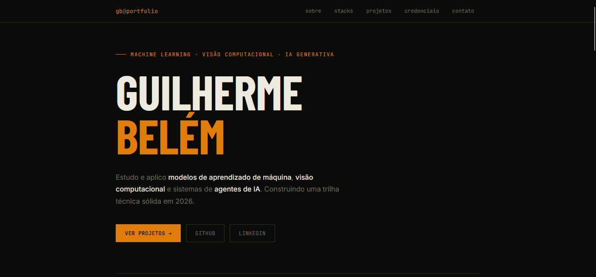

# Guilherme Pinho Belém — Portfólio

Portfólio pessoal desenvolvido como entregável da Trilha Front-end | Design de Experiência.

## Sobre o projeto

Aplicação React single-page que apresenta trajetória, habilidades, projetos e credenciais na área de Machine Learning e Visão Computacional.

## Seções

| Seção | Descrição |
|---|---|
| **Hero** | Apresentação com nome, área de atuação e links principais |
| **Sobre** | Trajetória pessoal e painel de estatísticas |
| **Stacks** | Tecnologias e ferramentas com indicador de proficiência |
| **Projetos** | Lista de projetos com tags e stack utilizada |
| **Página do projeto** | Detalhe individual com descrição completa e tecnologias |
| **Credenciais** | Tabela com 14 certificados e links de verificação |
| **Contato** | E-mail (copiar com clique), GitHub e LinkedIn |

## Stack técnica

- **React 19** + **TypeScript**
- **Vite 8** como bundler
- **Tailwind CSS v4**
- Fontes: Barlow Condensed, JetBrains Mono, Inter (Google Fonts)

## Estrutura de arquivos

```
src/
├── App.tsx       # Componentes e lógica da aplicação
├── index.css     # Tokens de design, CSS global e import do Tailwind
└── main.tsx      # Entrypoint React
```

## Como rodar

O servidor de desenvolvimento já está em execução no ambiente Figma Make. Alterações em `src/` são refletidas imediatamente via hot reload.

Para rodar localmente:

```bash
pnpm install
pnpm dev
```

## Requisitos atendidos

- [x] Seção de apresentação
- [x] Seção de stacks e habilidades
- [x] Seção de projetos
- [x] Página individual de projeto (navegação por estado React)

## [Link do figma](https://www.figma.com/make/iINUBZucw7Dy28Na60oBcS/Personal-Portfolio-Prototype?fullscreen=1&t=9IhgFYg3Qh3XAJI9-1&code-node-id=0-6)

# Imagens do projeto

